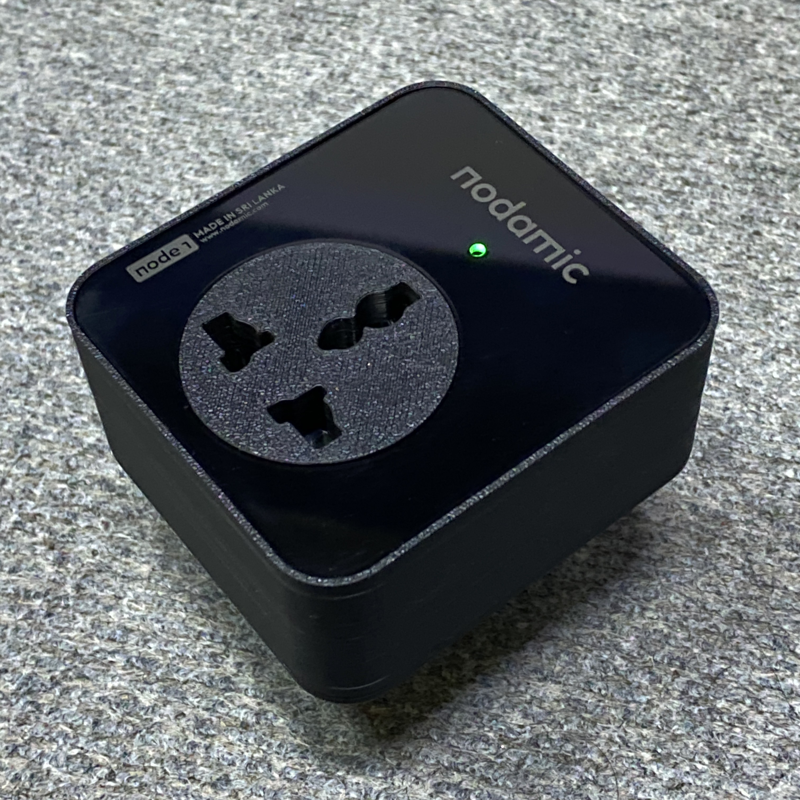
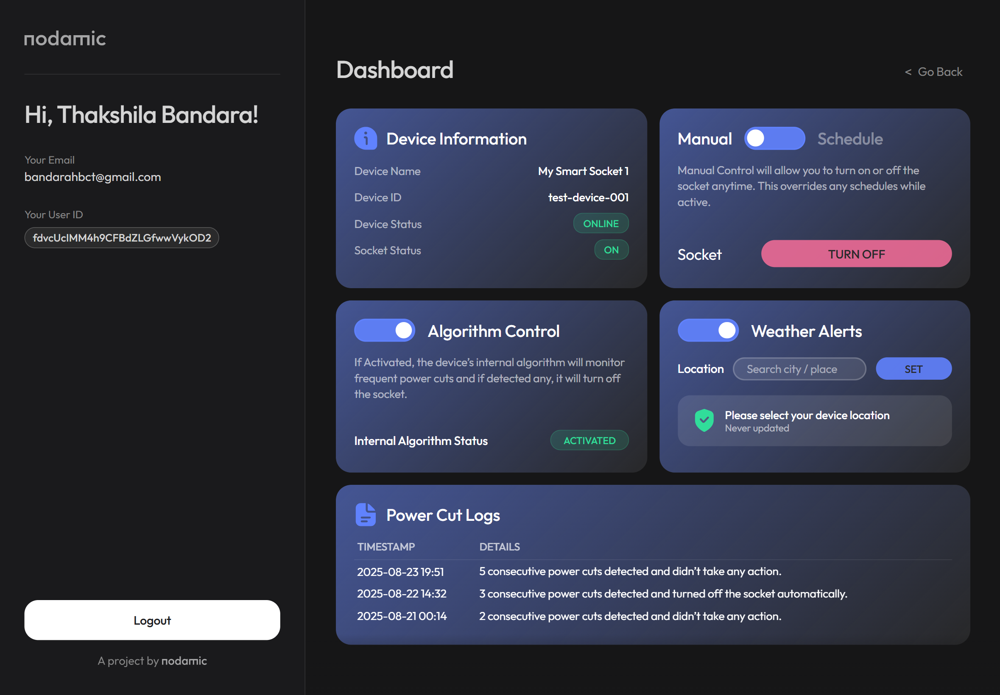

# Smart Power Socket 🔌

Welcome to the repository for the **Smart Power Socket**, a complete end-to-end IoT project. This socket enables remote power toggling, smart scheduling, weather-aware operation, and real-time energy monitoring.

## 📁 Repository Structure

We use a monorepo structure to keep all related domains of this project together:

- **[`/webapp`](./webapp/)**: The frontend React web application for monitoring and controlling the smart sockets.
- **[`/firmware`](./firmware/)**: The code that runs on the embedded microcontroller (e.g., ESP32/ESP8266).
- **[`/hardware`](./hardware/)**: Schematics, PCB layouts, and 3D printable enclosure designs.
- **[`/assets`](./assets/)**: Documentation media.
  - `/product-v1`: Photos of the initial prototype.
  - `/product-v2`: Photos of the high fidelity prototype.
  - `/ui-screenshots`: Screenshots of the web application in action.

## 🛠️ Components

### 1. Web Application
The web app is built with **React** and **Vite**. It provides a real-time dashboard to monitor device status, control the socket manually, and set up automated schedules. 
*See the [`webapp/README.md`](./webapp/README.md) for setup and deployment instructions.*

### 2. Firmware
The C/C++ firmware manages the hardware relays, connects to the local network, and communicates with the frontend via MQTT/REST.

### 3. Hardware (Coming Soon)
The custom electronics and casing required to safely switch high-voltage main power while housing the microcontroller and sensors.

## 📸 Gallery

  
  

## 🚀 Getting Started

To explore the codebase locally:

1. Clone the repository: `git clone https://github.com/its-thakshila/nodamic-smart-power-socket.git`
2. Follow the specific instructions in each sub-directory (e.g., `webapp`, `firmware`) to build and run the respective components.

---
*Developed by team Nodamic*
